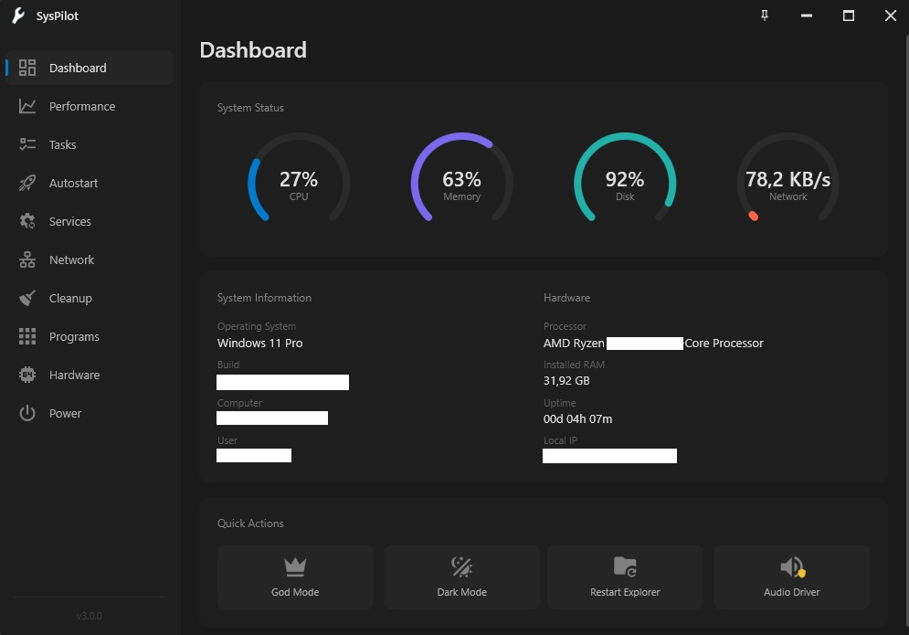

# SysPilot

   

A modern Windows system utility for power users.



## Features

- **Live System Monitoring** – CPU, RAM, Disk, Network with real-time graphs
- **System Info & Uptime** – OS, build, hardware specs, uptime (Fast Startup aware)
- **Task Manager** – Grouped processes, multi-select, window picker
- **Autostart Manager** – View and control startup programs
- **Services Manager** – Start, stop, restart Windows services
- **Network** – Adapters, connections, public IP, flush DNS
- **Disk Cleanup** – e.g. temp files, browser cache, recycle bin
- **Programs** – Quick uninstall for installed programs
- **Hardware Info** – e.g. CPU, GPU, RAM, storage
- **Power Controls** – e.g. shutdown, restart, sleep, lock
- **System Tools** – e.g. Device Manager, Registry Editor
- **Run Dialog** – With autocomplete and Run as Admin option
- **Quick Actions** – e.g. God Mode, Dark Mode toggle

**Additional**

- Pin on top (optional)
- 11 languages (EN, DE, FR, ES, IT, NL, PL, RU, JA, ZH-CN, ZH-TW)
- Language auto-detection with manual override (`.preferred-lang` file)

## Requirements

- Windows 10/11 (x64)
- No additional dependencies (self-contained)

## Installation

Download and run `SysPilotSetup.exe`. The installer will guide you through the process.

Default install location: `C:\Program Files\SysPilot`

## Language Override

To force a specific language, create a file named `.preferred-lang` in the `lang` folder containing the language code (e.g., `en`, `de`, `fr`).

## Building

Requirements:

- .NET 10 SDK
- Windows
- Visual Studio Build Tools with C++ workload (for Native AOT)
- Windows SDK

```bash
# Build all projects
dotnet build

# Build installer (creates SysPilotSetup.exe)
powershell -ExecutionPolicy Bypass -File build-installer.ps1
```

Output: `SysPilot.Installer\bin\Release\net10.0-windows\win-x64\publish\SysPilotSetup.exe`

## Project Structure

```
SysPilot/              # Main application (WPF)
├── Pages/             # UI pages
├── Controls/          # Custom controls
├── Helpers/           # System interaction helpers
└── lang/              # Localization files

SysPilot.Installer/    # Native AOT installer
SysPilot.Uninstaller/  # Native AOT uninstaller
```

## License

MIT
